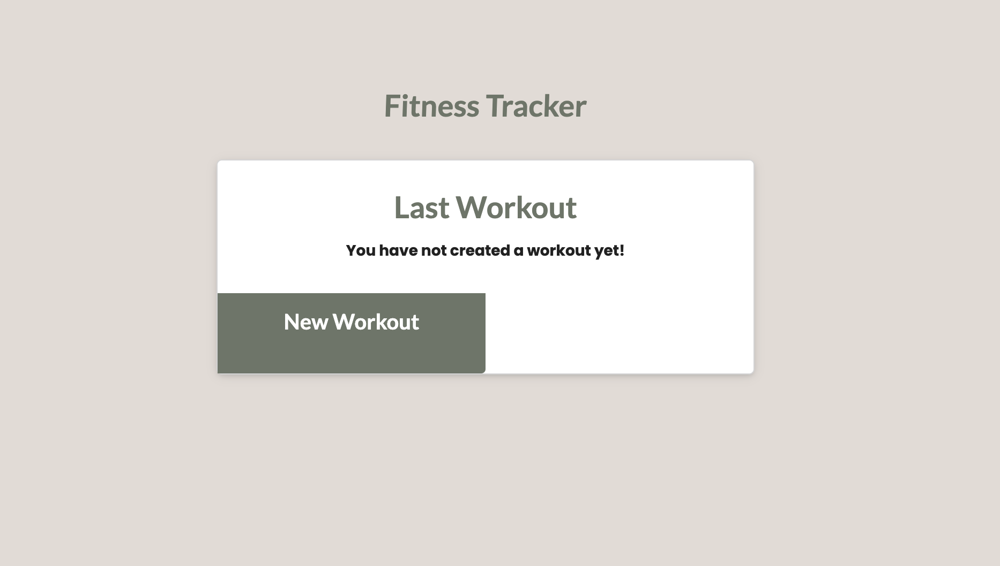
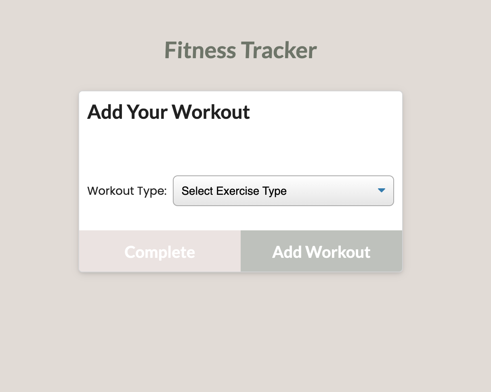
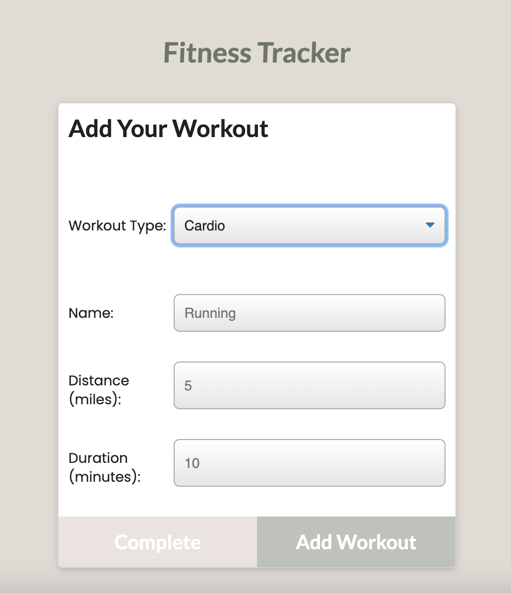
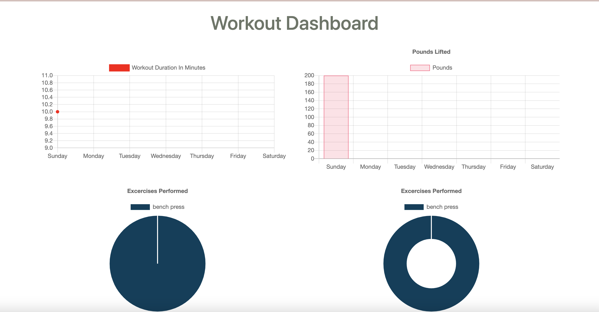

# NoSQL: Workout Tracker

  

  ## Table of Contents
  * [Description](#description)
  * [Installation](#installation)
  * [Usage](#usage)
  * [Contact Information](#contact-information)
  * [License](#license)
  
  
  ## Description
  Using Mongo and Express, create a workout tracker that will create and track the users daily workout.
  ## Installation
  In order to install this app, the user must ensure to acquire all their dependencies by downloading the following npm packages: 
  * `express` 
  * `mongoose` 
  * `morgan` 
  The user must also ensure that they include the their start script in their package.json

  ## Usage
  Using this app, the user will be able to view create and track daily workouts. They will be able to log multiple exercises in a workout on a given day. They can track the name, type, weight, sets, reps, and duration of exercise. If the exercise is a cardio exercise, They are be able to track my distance traveled.
  
  On the first page of the app, you're given the option to create a new workout
  

  Once you click on the new workout button, you are given a form to fill out where you give all the necessary details of your new workout.
  

  

  Once the workout is saved and complete, you can navigate to the stats page where you are given stats on your workouts
  

  Please click the link below to visit the app:
  * [Workout Tracker](https://quiet-garden-62852.herokuapp.com/)

  * [Github Repo](https://github.com/crystal-g-b/NoSQL-Workout-Tracker)
 
  ## Contact-Information
  * GitHub: [crystal-g-b](https://github.com/crystal-g-b)
  * Email: crystal.barnett1@gmail.com

  ## License:
  * [The MIT License](https://opensource.org/license/MIT)
